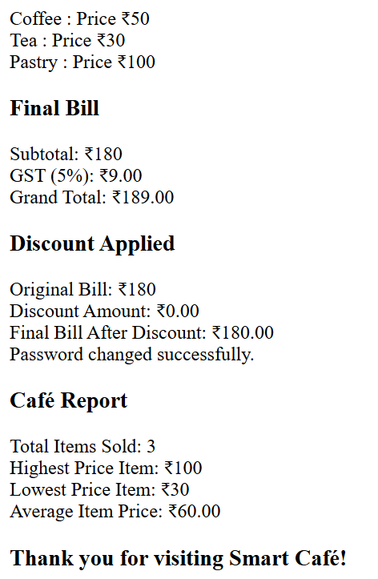

# ☕ Smart Café Billing System  

A simple **JavaScript-based mini project** that simulates a café billing system. The program allows customers to place orders, generate bills, apply discounts, change the café password, and view a sales report.  

This project is designed using **basic JavaScript constructs only**:  
- `do…while` loops  
- `if…else` conditions  
- simple variables  
- no arrays, no functions  

---

## 📌 Features  

1. **Place Orders**  
   - Choose from menu items: Coffee, Tea, Sandwich, Pastry  
   - Keeps track of total bill, highest priced item, lowest priced item  

2. **View Bill**  
   - Displays subtotal, GST (5%), and grand total  

3. **Apply Discounts**  
   - 20% discount if bill > ₹1000  
   - 10% discount if bill > ₹500  

4. **Change Café Password**  
   - Secure option to update café password with validation  

5. **View Café Report**  
   - Shows total items sold  
   - Displays highest & lowest priced item  
   - Calculates average price of sold items  

6. **Exit System**  
   - Ends program gracefully with a thank-you message  

---

## 📸 Program Output 

  

## ▶️ How to Run  

1. Copy the code into a file named `index.html`  
2. Open it in any modern browser (Chrome, Edge, Firefox, etc.)  
3. Use the pop-up prompts to interact with the system  

